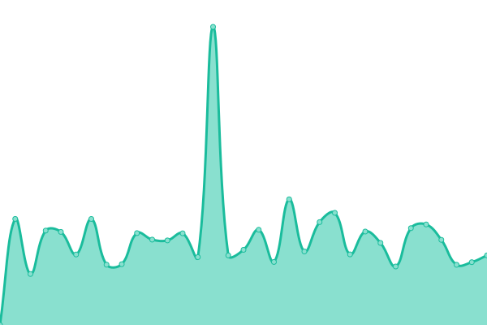
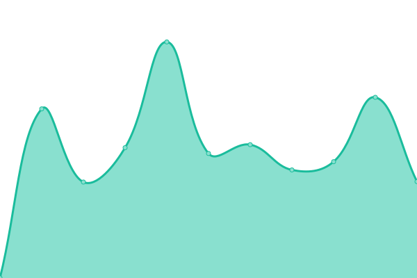

# [📈 Live Status](https://n0i2.github.io/upptime): <!--live status--> **🟩 All systems operational**

This repository contains the open-source uptime monitor and status page for various services, powered by [Upptime](https://github.com/upptime/upptime).

With [Upptime](https://upptime.js.org), you can get your own unlimited and free uptime monitor and status page, powered entirely by a GitHub repository. We use [Issues](https://github.com/n0i2/upptime/issues) as incident reports, [Actions](https://github.com/n0i2/upptime/actions) as uptime monitors, and [Pages](https://n0i2.github.io/upptime) for the status page.

<!--start: status pages-->
<!-- This summary is generated by Upptime (https://github.com/upptime/upptime) -->
<!-- Do not edit this manually, your changes will be overwritten -->
<!-- prettier-ignore -->
| URL | Status | History | Response Time | Uptime |
| --- | ------ | ------- | ------------- | ------ |
|  [IpHost](https://www.iphost.net) | 🟩 Up | [ip-host.yml](https://github.com/n0i2/upptime/commits/HEAD/history/ip-host.yml) | 

 2143ms
     
 | 

<a href="https://n0i2.github.io/upptime/history/ip-host">99.36%</a>
    

|  [n0i2.eu](https://n0i2.eu) | 🟩 Up | [n0i2-eu.yml](https://github.com/n0i2/upptime/commits/HEAD/history/n0i2-eu.yml) | 

 1369ms
     
 | 

<a href="https://n0i2.github.io/upptime/history/n0i2-eu">99.83%</a>
    

|  Oracle VM | 🟩 Up | [oracle-vm.yml](https://github.com/n0i2/upptime/commits/HEAD/history/oracle-vm.yml) | 

 119ms
     
 | 

<a href="https://n0i2.github.io/upptime/history/oracle-vm">99.80%</a>
    

<!--end: status pages-->

[**Visit our status website →**](https://n0i2.github.io/upptime/)

## 📄 License

- Powered by: [Upptime](https://github.com/upptime/upptime)
- Code: [MIT](./LICENSE) © [Anand Chowdhary](https://anandchowdhary.com), supported by [Pabio](https://pabio.com)
- Data in the `./history` directory: [Open Database License](https://opendatacommons.org/licenses/odbl/1-0/)
